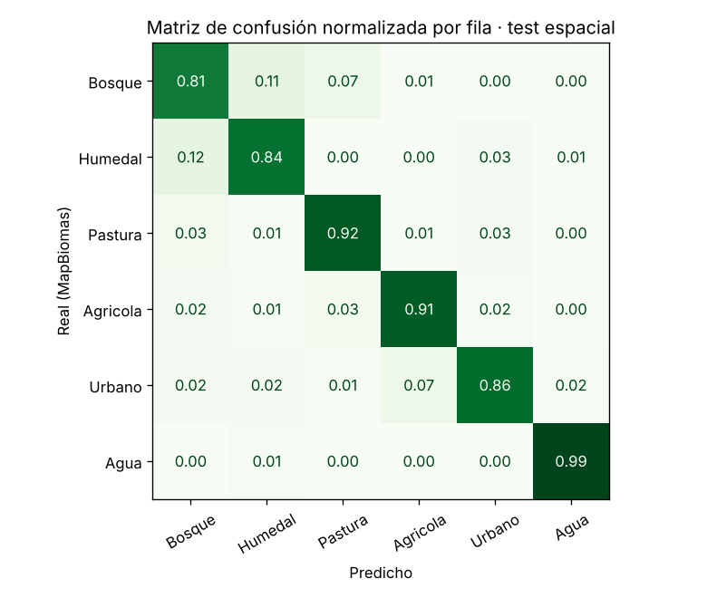
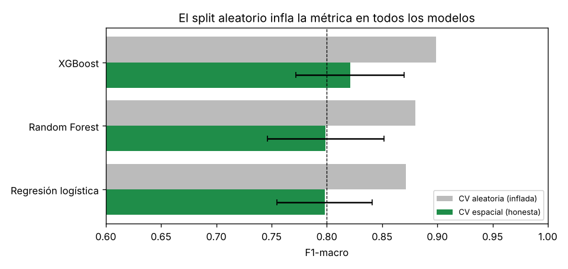
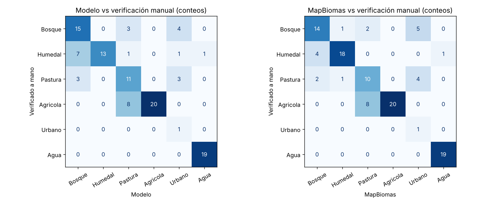

# Clasificación de cobertura del suelo en Villa Hayes con Sentinel-2

Proyecto final - Diplomado en Machine Learning y Deep Learning Aplicado - FIUNA
Juan Cardozo Becvort

## Problema

El distrito de Villa Hayes (Presidente Hayes, Bajo Chaco) tiene 17 650 km². Hoy hay dos
formas de saber qué cubre cada parte de ese territorio:

- **Fotointerpretación manual:** precisa, pero lleva semanas de trabajo técnico y hay que
  repetirla para cada actualización.
- **MapBiomas:** gratuito, pero anual, con atraso (llega a 2023) y a 30 m.

Este trabajo es para responsables de planificación territorial y gestión ambiental que necesitan
un mapa actualizado sin pagar esas semanas de digitalización.

## Objetivo

Clasificar cada píxel de 10 m de Sentinel-2 en 6 clases de cobertura (**bosque, humedal,
pastura, agrícola, urbano y agua**) a partir de su comportamiento en la temporada húmeda y en
la seca, con un modelo aplicable a años que MapBiomas todavía no cubre.

**Métrica de éxito:** F1-macro ≥ 0.80 en un test espacialmente independiente. Además se mide
contra 110 puntos verificados a mano, para separar el error del modelo del error de las etiquetas. Usamos F1-macro y
no accuracy porque más del 90% del distrito es bosque: un modelo que diga siempre "bosque"
tendría 90% de accuracy y no serviría para nada.

## Datos

| | Fuente | Detalle |
|---|---|---|
| Imágenes | Sentinel-2 SR Harmonized | 10 bandas, compuesto mediano por temporada (húmeda dic–mar, seca jun–sep) |
| Etiquetas | MapBiomas Chaco Colección 5 | reclasificadas a 6 clases; solo píxeles en zonas homogéneas de 90 × 90 m |
| Límite | INE Paraguay | distrito de Villa Hayes |
| Muestras | 9 000 píxeles | 500 por clase y por año (2019, 2021, 2023), 560 bloques espaciales |

**Features (37 por píxel):** 10 bandas y 6 índices (NDVI, NDWI, MNDWI, NDBI, BSI, SAVI) por
temporada, más 5 diferencias húmeda − seca.

La extracción se hizo en Google Earth Engine (`extraccion/pf_nb1_extraccion_muestras.ipynb`).
`notebook_final.ipynb` **no depende de Earth Engine**: lee el CSV y corre en cualquier máquina.

## Modelo

- **Preprocesamiento:** `ColumnTransformer` (imputación por mediana + `StandardScaler`) dentro
  de un `Pipeline`.
- **Validación:** `StratifiedGroupKFold` por bloques espaciales de ~5.5 km. Ningún bloque
  aparece en train y en test a la vez, para evitar la fuga por autocorrelación espacial.
- **Modelos comparados:** baseline (clase más frecuente), regresión logística, Random Forest y
  XGBoost.

| Modelo | F1-macro CV espacial | F1-macro CV aleatoria |
|---|---|---|
| Dummy (baseline) | 0.023 ± 0.016 | 0.048 |
| Regresión logística | 0.798 ± 0.043 | 0.872 |
| Random Forest | 0.799 ± 0.053 | 0.880 |
| **XGBoost** | **0.821 ± 0.049** | 0.899 |

La CV aleatoria infla el F1-macro entre 7 y 8 puntos en todos los modelos, es la evidencia de
que la validación espacial era necesaria.

## Resultado

**Modelo elegido: XGBoost.** Tiene el mayor F1-macro en CV espacial y pesa 1.1 MB.

| Clase | F1 en test |
|---|---|
| Bosque | 0.81 |
| Humedal | 0.84 |
| Pastura | 0.91 |
| Agrícola | 0.91 |
| Urbano | 0.89 |
| Agua | 0.98 |
| **F1-macro** | **0.89** |

El test (0.89) sale por encima del promedio de CV (0.82): la CV incluye el fold donde la ciudad
de Villa Hayes queda fuera del entrenamiento, que es el peor caso. **La cifra prudente es 0.82.**
Las dos superan el umbral de 0.80.

La confusión principal es **bosque - humedal**, dos coberturas de vegetación densa y húmeda en
época de lluvias. Según SHAP, las variables que más pesan son las bandas SWIR (B11, B12) de
**las dos temporadas**: son sensibles al contenido de agua del suelo y de la vegetación.




### Validación independiente (110 puntos verificados manualmente, 2023)

Los puntos salen de bloques que el modelo no vio, y cada uno se verificó sobre imagen de alta
resolución sin considerar la etiqueta de MapBiomas.

| | Modelo | MapBiomas |
|---|---|---|
| Accuracy | 0.72 (IC 95% 0.64–0.80) | 0.75 (IC 95% 0.67–0.83) |
| F1-macro sin Urbano | 0.74 | 0.77 |

**Contra la verificación manual, el modelo no alcanza el umbral de 0.80, y MapBiomas tampoco.**
La diferencia entre los dos no es significativa (−0.03, IC 95% de −0.08 a +0.02) y coinciden en
el 87% de los puntos: el modelo aprendió MapBiomas con sus errores incluidos. El caso más claro
es pastura ↔ cultivo: 8 puntos que MapBiomas llama pastura eran cultivo, y el modelo los
clasifica igual. Urbano tiene un solo punto verificado y no se puede evaluar.

**Conclusión:** el techo lo ponen las etiquetas, no el algoritmo. El modelo entrega un mapa del
nivel de MapBiomas, pero a 10 m y para cualquier año. Superarlo exige entrenar con etiquetas
mejores.



## Limitaciones

- Las etiquetas vienen de MapBiomas (30 m) y el modelo hereda sus errores, como muestra la
  validación manual.
- La validación manual tiene 110 puntos, los intervalos de confianza son anchos.
- El área urbana está concentrada en muy pocos bloques.
- La clase "suelo desnudo" se considero incluir pero no existe en el distrito según MapBiomas y se descartó al poder asociarse la misma a urbanos, pasturas y agricolas.

## Estructura

```
├── README.md
├── notebook_final.ipynb          pipeline completo, ejecutado
├── model.pkl                     Pipeline + XGBoost + metadatos (joblib)
├── datos_muestra.csv             100 píxeles del test
├── app.py                        app de Streamlit
├── requirements.txt
├── data/muestras_villa_hayes.csv dataset completo (9 000 filas)
├── data/validacion_verificada.csv 110 puntos verificados a mano
├── extraccion/                   notebook de Earth Engine (se corre una vez)
└── img/                          figuras
```

## Para ejecutarlo

```bash
pip install -r requirements.txt
jupyter nbconvert --to notebook --execute notebook_final.ipynb   # o abrirlo y "Run All"
streamlit run app.py
```

`scikit-learn` y `xgboost` están fijados en `requirements.txt` porque `model.pkl` se guardó
con esas versiones.

## Próximos pasos

1. Aplicar el modelo a 2025, que MapBiomas todavía no cubre, y cuantificar la conversión de
   bosque a pastura y cultivo desde 2019.
2. Sumar radar Sentinel-1, que no depende de las nubes y ayuda a separar humedal de bosque.
3. Usar los puntos verificados manualmente, ampliados, como etiquetas de entrenamiento: es la única
   vía para que el modelo supere a MapBiomas en vez de imitarlo.
